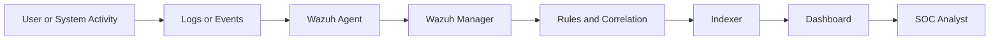

# Module 1: SOC Fundamentals and Wazuh Basics

This module gives you the foundation for everything that follows. The goal is not only to define terms, but to help you understand what a SOC analyst sees, what Wazuh does, and how an alert moves from an endpoint into a dashboard.

## What You Should Understand By The End

After this module, you should be able to:
- Explain the role of a SOC and the difference between monitoring and response
- Describe what a SIEM does and where Wazuh fits
- Read a simple Wazuh architecture diagram without guessing what each component means
- Prepare a beginner lab for a small Wazuh deployment
- Complete the first configuration and troubleshooting exercises

## Module Map

```mermaid
flowchart LR
    A[SOC Basics] --> B[SIEM Role]
    B --> C[Wazuh Introduction]
    C --> D[Wazuh Architecture]
    D --> E[OS Selection]
    E --> F[Wazuh vs Competitors]
    F --> G[Lab 01 SOC Setup]
    G --> H[Lab 01 Wazuh Single Node]
    H --> I[Lab 03 Basic Configuration]
    I --> J[Lab 04 Troubleshooting]
```



## The Main Story In This Module

Use this simple model while reading:



If that flow is clear to you, the later modules become much easier.

## What Exists In This Module Today

```
Module-1-SOC-Fundamentals/
├── README.md
├── theory/
│   ├── 01-soc-basics.md
│   ├── 02-siem-role.md
│   ├── 03-wazuh-introduction.md
│   ├── 04-wazuh-architecture.md
│   ├── 05-os-selection.md
│   └── 06-wazuh-vs-competitors.md
├── labs/
│   ├── lab-01-soc-setup.md
│   ├── lab-01-wazuh-single-node.md
│   ├── lab-03-basic-configuration.md
│   └── lab-04-troubleshooting.md
└── resources/
    ├── further-reading.md
    ├── key-terms.md
    └── quiz-answers.md
```

## Recommended Order

1. Read [SOC Basics](./theory/01-soc-basics.md).
2. Read [SIEM Role](./theory/02-siem-role.md) and [Wazuh Introduction](./theory/03-wazuh-introduction.md).
3. Spend extra time on [Wazuh Architecture](./theory/04-wazuh-architecture.md).
4. Review [OS Selection](./theory/05-os-selection.md) before installing anything.
5. Run [Lab 01: SOC Setup](./labs/lab-01-soc-setup.md).
6. Run [Lab 01: Wazuh Single-Node](./labs/lab-01-wazuh-single-node.md).
7. Finish with configuration and troubleshooting labs.

## Study Advice For Beginners

- Do not try to memorize every term on the first pass.
- Focus on the event flow: source, collection, analysis, alert, investigation.
- When a diagram feels abstract, connect it to one example such as a failed login or file change.
- Keep a small notebook of ports, services, config files, and troubleshooting commands.

## Success Check

You are ready for Module 2 when you can answer these questions clearly:
- What is the job of a SOC analyst?
- What does a SIEM collect and why?
- What is the difference between a Wazuh agent, manager, indexer, and dashboard?
- How does one event become one alert?

## Continue

Start with [SOC Basics](./theory/01-soc-basics.md) and move through the files in order. If you get stuck on the architecture chapter, pause and draw the data flow yourself before continuing.