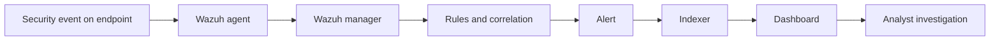
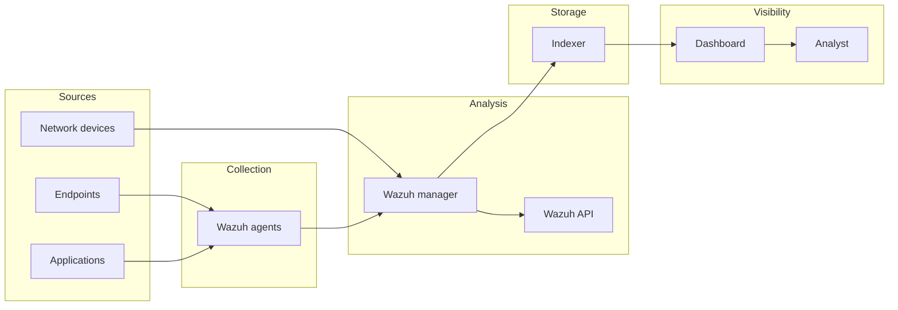

# Wazuh Architecture Explained

## Quick Mental Model

Before going deep into the components, keep this event path in mind:



This is the simplest way to understand Wazuh. Everything else in this chapter explains one part of that chain.

## 🎯 Learning Objectives

By the end of this section, you will understand:
- Wazuh's architectural components and their roles
- Data flow through the Wazuh system
- Different deployment architectures
- Scaling considerations for enterprise environments

## 🏗️ Wazuh Architecture Overview

### High-Level Architecture



```
┌─────────────────────────────────────────────────────────────┐
│                    WAZUH ARCHITECTURE                      │
├─────────────────────────────────────────────────────────────┤
│  ┌─────────────┐    ┌─────────────┐    ┌─────────────┐      │
│  │   WAZUH     │    │   INDEXER   │    │  DASHBOARD  │      │
│  │   SERVER    │◄──►│ (Elastic/  │◄──►│ (Kibana/   │      │
│  │   (Manager) │    │  OpenSearch)│    │  OpenSearch │      │
│  │             │    │             │    │  Dashboards)│      │
│  │ • Analysis  │    │ • Storage   │    │ • UI        │      │
│  │ • Rules     │    │ • Search    │    │ • Visual    │      │
│  │ • API       │    │ • Analytics │    │             │      │
│  └─────────────┘    └─────────────┘    └─────────────┘      │
│         ▲                     ▲                     ▲       │
├─────────┼─────────────────────┼─────────────────────┼───────┤
│  ┌──────┴─────┐    ┌──────────┴─────────┐    ┌──────┴─────┐  │
│  │   WAZUH    │    │      ENDPOINTS     │    │    APIs    │  │
│  │   AGENTS   │    │   & DEVICES        │    │             │  │
│  │            │    │                    │    │ • Cloud     │  │
│  │ • Windows  │    │ • Network Devices  │    │ • External  │  │
│  │ • Linux    │    │ • Applications     │    │   Tools     │  │
│  │ • macOS    │    │ • Cloud Services   │    │             │  │
│  └────────────┘    └────────────────────┘    └────────────┘  │
└─────────────────────────────────────────────────────────────┘
```

## 🔧 Core Components Deep Dive

### 1. Wazuh Server (Manager)

#### Architecture Details
```
┌─────────────────────────────────────────────────────────────┐
│                    WAZUH SERVER                             │
├─────────────────────────────────────────────────────────────┤
│  ┌─────────────┐  ┌─────────────┐  ┌─────────────┐          │
│  │   ANALYSIS  │  │   REMOTE    │  │   CLUSTER   │          │
│  │   DAEMON    │  │   DAEMON    │  │   DAEMON    │          │
│  │             │  │             │  │             │          │
│  │ • Log       │  │ • Agent     │  │ • Node      │          │
│  │   Analysis  │  │   Comm.     │  │   Sync      │          │
│  │ • Rule      │  │ • Syslog    │  │ • Load      │          │
│  │   Engine    │  │   Input     │  │   Balance   │          │
│  │ • Statistics│  │             │  │ • Health    │          │
│  └─────────────┘  └─────────────┘  └─────────────┘          │
├─────────────────────────────────────────────────────────────┤
│  ┌─────────────┐  ┌─────────────┐  ┌─────────────┐          │
│  │   REST API  │  │   DATABASE  │  │   DECODERS  │          │
│  │   SERVICE   │  │   SERVICE   │  │   & RULES   │          │
│  │             │  │             │  │             │          │
│  │ • External  │  │ • Agent     │  │ • Log       │          │
│  │   Access    │  │   Info      │  │   Parsing   │          │
│  │ • Data      │  │ • Config    │  │ • Custom    │          │
│  │   Export    │  │ • Internal  │  │   Rules     │          │
│  │ • Web UI    │  │   Logs      │  │             │          │
│  └─────────────┘  └─────────────┘  └─────────────┘          │
└─────────────────────────────────────────────────────────────┘
```

#### Key Functions
- **Log Analysis**: Process and analyze incoming security data
- **Rule Engine**: Apply detection rules to identify threats
- **Agent Management**: Control and monitor Wazuh agents
- **API Services**: Provide programmatic access
- **Cluster Coordination**: Manage multi-node deployments

### 2. Wazuh Agents

#### Agent Architecture
```
┌─────────────────────────────────────────────────────────────┐
│                    WAZUH AGENT                              │
├─────────────────────────────────────────────────────────────┤
│  ┌─────────────┐  ┌─────────────┐  ┌─────────────┐          │
│  │   CONTROL   │  │   LOG       │  │   SYSCHECK  │          │
│  │   MODULE    │  │   COLLECTOR │  │   MODULE    │          │
│  │             │  │             │  │             │          │
│  │ • Config    │  │ • File      │  │ • FIM       │          │
│  │ • Status    │  │   Monitor   │  │ • Integrity │          │
│  │ • Commands  │  │ • Syslog    │  │ • Changes   │          │
│  └─────────────┘  └─────────────┘  └─────────────┘          │
├─────────────────────────────────────────────────────────────┤
│  ┌─────────────┐  ┌─────────────┐  ┌─────────────┐          │
│  │   ROOTCHECK │  │   SCA       │  │   ACTIVE    │          │
│  │   MODULE    │  │   MODULE    │  │   RESPONSE  │          │
│  │             │  │             │  │   MODULE    │          │
│  │ • Rootkit   │  │ • Policy    │  │ • Auto      │          │
│  │   Detect    │  │   Check     │  │   Response  │          │
│  │ • Policy    │  │ • Compliance│  │ • Commands  │          │
│  │   Monitor   │  │             │  │             │          │
│  └─────────────┘  └─────────────┘  └─────────────┘          │
└─────────────────────────────────────────────────────────────┘
```

#### Agent Modules
- **Log Collector**: Gather logs from files and Windows event logs
- **Syscheck**: File integrity monitoring and rootkit detection
- **Rootcheck**: System policy monitoring and anomaly detection
- **SCA**: Security configuration assessment
- **Active Response**: Automated threat response capabilities

### 3. Indexer (Elasticsearch/OpenSearch)

#### Storage Architecture
```
┌─────────────────────────────────────────────────────────────┐
│                    INDEXER LAYER                            │
├─────────────────────────────────────────────────────────────┤
│  ┌─────────────┐  ┌─────────────┐  ┌─────────────┐          │
│  │   INGEST    │  │   SEARCH    │  │   ANALYTICS │          │
│  │   PIPELINE  │  │   ENGINE    │  │   ENGINE    │          │
│  │             │  │             │  │             │          │
│  │ • Data      │  │ • Full-text │  │ • Aggrega-  │          │
│  │   Process   │  │   Search    │  │   tions     │          │
│  │ • Transform │  │ • Filters   │  │ • Metrics   │          │
│  │ • Enrich    │  │ • Query DSL │  │ • Visual    │          │
│  └─────────────┘  └─────────────┘  └─────────────┘          │
├─────────────────────────────────────────────────────────────┤
│  ┌─────────────┐  ┌─────────────┐                           │
│  │   CLUSTER   │  │   SECURITY  │                           │
│  │   MGMT      │  │   FEATURES  │                           │
│  │             │  │             │                           │
│  │ • Node      │  │ • Authen-   │                           │
│  │   Discovery │  │   tication  │                           │
│  │ • Shard     │  │ • TLS       │                           │
│  │   Balance   │  │ • RBAC      │                           │
│  └─────────────┘  └─────────────┘                           │
└─────────────────────────────────────────────────────────────┘
```

### 4. Dashboard (Kibana/OpenSearch Dashboards)

#### Visualization Layer
```
┌─────────────────────────────────────────────────────────────┐
│                  DASHBOARD LAYER                            │
├─────────────────────────────────────────────────────────────┤
│  ┌─────────────┐  ┌─────────────┐  ┌─────────────┐          │
│  │   VISUAL    │  │   DASHBOARD │  │   REPORTING │          │
│  │   BUILDER   │  │   MGMT      │  │   ENGINE    │          │
│  │             │  │             │  │             │          │
│  │ • Charts    │  │ • Custom    │  │ • PDF       │          │
│  │ • Graphs    │  │   Layouts   │  │   Export    │          │
│  │ • Maps      │  │ • Filters   │  │ • Scheduled │          │
│  │ • Tables    │  │ • Drill-down│  │   Reports   │          │
│  └─────────────┘  └─────────────┘  └─────────────┘          │
├─────────────────────────────────────────────────────────────┤
│  ┌─────────────┐  ┌─────────────┐                           │
│  │   ALERTING  │  │   QUERY     │                           │
│  │   SYSTEM    │  │   INTERFACE │                           │
│  │             │  │             │                           │
│  │ • Threshold │  │ • Saved     │                           │
│  │   Alerts    │  │   Searches  │                           │
│  │ • Custom    │  │ • Visual    │                           │
│  │   Actions   │  │   Builder   │                           │
│  └─────────────┘  └─────────────┘                           │
└─────────────────────────────────────────────────────────────┘
```

## 🔄 Data Flow Architecture

### End-to-End Data Flow

```
1. Data Collection
   ┌─────────────┐
   │  ENDPOINT   │ ← Logs, Events, Metrics
   └──────┬──────┘
          │
          ▼
2. Agent Processing
   ┌─────────────┐
   │   WAZUH     │ ← Parse, Filter, Enrich
   │   AGENT     │
   └──────┬──────┘
          │
          ▼
3. Transport Layer
   ┌─────────────┐
   │  ENCRYPTED  │ ← AES Encryption
   │  CHANNEL    │
   └──────┬──────┘
          │
          ▼
4. Server Analysis
   ┌─────────────┐
   │  WAZUH      │ ← Rules, Correlation, Alerts
   │  SERVER     │
   └──────┬──────┘
          │
          ▼
5. Storage & Indexing
   ┌─────────────┐
   │  INDEXER    │ ← Search, Analytics
   │ (Elastic)   │
   └──────┬──────┘
          │
          ▼
6. Visualization
   ┌─────────────┐
   │ DASHBOARD   │ ← Charts, Reports, Alerts
   │ (Kibana)    │
   └─────────────┘
```

### Communication Protocols

#### Agent-Server Communication
- **Protocol**: TCP/UDP (ports 1514-1515)
- **Encryption**: AES 256-bit encryption
- **Authentication**: Agent registration keys
- **Heartbeat**: Regular connectivity checks

#### Server-Indexer Communication
- **Protocol**: HTTP/HTTPS (port 9200)
- **Authentication**: API keys or certificates
- **Data Format**: JSON documents
- **Bulk Operations**: Batch data ingestion

## 🏢 Deployment Architectures

### 1. Single-Node Deployment

```
┌─────────────────────────────────────────────────────────────┐
│                SINGLE-NODE DEPLOYMENT                       │
├─────────────────────────────────────────────────────────────┤
│  ┌─────────────────────────────────────────────────────────┐ │
│  │                    SINGLE SERVER                        │ │
│  ├─────────────────────────────────────────────────────────┤ │
│  │  ┌─────────────┐  ┌─────────────┐  ┌─────────────┐      │ │
│  │  │   WAZUH     │  │ ELASTIC-   │  │   KIBANA    │      │ │
│  │  │   SERVER    │  │ SEARCH     │  │             │      │ │
│  │  └─────────────┘  └─────────────┘  └─────────────┘      │ │
│  └─────────────────────────────────────────────────────────┘ │
├─────────────────────────────────────────────────────────────┤
│  • Simple setup        • Limited scalability                 │
│  • Low resource req.   • Single point of failure            │
│  • Perfect for labs     • Not for production                 │
└─────────────────────────────────────────────────────────────┘
```

**Use Cases:**
- Development and testing
- Small environments (< 50 agents)
- Learning and training
- Proof of concept deployments

### 2. Distributed Deployment

```
┌─────────────────────────────────────────────────────────────┐
│                DISTRIBUTED DEPLOYMENT                       │
├─────────────────────────────────────────────────────────────┤
│  ┌─────────────┐    ┌─────────────┐    ┌─────────────┐      │
│  │   WAZUH     │    │ ELASTIC-   │    │   KIBANA    │      │
│  │   SERVER    │    │ SEARCH     │    │             │      │
│  │   (Node 1)  │    │   (Node 2) │    │   (Node 3)  │      │
│  └─────────────┘    └─────────────┘    └─────────────┘      │
├─────────────────────────────────────────────────────────────┤
│  ┌─────────────┐    ┌─────────────┐    ┌─────────────┐      │
│  │   WAZUH     │    │   WAZUH     │    │   WAZUH     │      │
│  │   AGENTS    │    │   AGENTS    │    │   AGENTS    │      │
│  │   (Group A) │    │   (Group B) │    │   (Group C) │      │
│  └─────────────┘    └─────────────┘    └─────────────┘      │
├─────────────────────────────────────────────────────────────┤
│  • Better performance   • Higher availability               │
│  • Load distribution    • Complex setup                     │
│  • Scalable design      • More resources needed             │
└─────────────────────────────────────────────────────────────┘
```

**Use Cases:**
- Medium to large environments
- Geographic distribution
- High availability requirements
- Performance-critical deployments

### 3. Cluster Deployment

```
┌─────────────────────────────────────────────────────────────┐
│                  CLUSTER DEPLOYMENT                         │
├─────────────────────────────────────────────────────────────┤
│  ┌─────────────────────────────────────────────────────────┐ │
│  │                 WAZUH CLUSTER                           │ │
│  ├─────────────────────────────────────────────────────────┤ │
│  │  ┌─────────────┐  ┌─────────────┐  ┌─────────────┐      │ │
│  │  │  WAZUH SRV  │  │  WAZUH SRV  │  │  WAZUH SRV  │      │ │
│  │  │    #1       │  │    #2       │  │    #3       │      │ │
│  │  └─────────────┘  └─────────────┘  └─────────────┘      │ │
│  └─────────────────────────────────────────────────────────┘ │
├─────────────────────────────────────────────────────────────┤
│  ┌─────────────────────────────────────────────────────────┐ │
│  │              ELASTICSEARCH CLUSTER                      │ │
│  ├─────────────────────────────────────────────────────────┤ │
│  │  ┌─────────────┐  ┌─────────────┐  ┌─────────────┐      │ │
│  │  │ ELASTIC-   │  │ ELASTIC-   │  │ ELASTIC-   │      │ │
│  │  │ SEARCH #1  │  │ SEARCH #2  │  │ SEARCH #3  │      │ │
│  │  └─────────────┘  └─────────────┘  └─────────────┘      │ │
│  └─────────────────────────────────────────────────────────┘ │
├─────────────────────────────────────────────────────────────┤
│  ┌─────────────────────────────────────────────────────────┐ │
│  │                   KIBANA CLUSTER                        │ │
│  ├─────────────────────────────────────────────────────────┤ │
│  │  ┌─────────────┐  ┌─────────────┐                       │ │
│  │  │   KIBANA    │  │   KIBANA    │                       │ │
│  │  │    #1       │  │    #2       │                       │ │
│  │  └─────────────┘  └─────────────┘                       │ │
│  └─────────────────────────────────────────────────────────┘ │
├─────────────────────────────────────────────────────────────┤
│  • Enterprise scale     • Maximum availability              │
│  • Geographic distrib.  • Complex management                │
│  • Auto load balance    • High resource req.                │
└─────────────────────────────────────────────────────────────┘
```

**Use Cases:**
- Large enterprise environments
- Global organizations
- Mission-critical systems
- High-volume data processing

## 📊 Scaling Considerations

### Horizontal Scaling Factors

#### Wazuh Server Scaling
- **Agent Count**: Number of managed endpoints
- **EPS (Events Per Second)**: Incoming event volume
- **Rule Complexity**: Analysis processing requirements
- **Retention Period**: Historical data storage needs

#### Indexer Scaling
- **Data Volume**: Daily ingestion volume
- **Query Load**: Search and analytics requirements
- **Retention Policies**: Data lifecycle management
- **Backup Strategy**: Recovery time objectives

#### Storage Considerations
- **Hot Storage**: Frequently accessed recent data
- **Warm Storage**: Less frequently accessed historical data
- **Cold Storage**: Archived data with infrequent access
- **Data Lifecycle**: Automated data movement policies

### Performance Optimization

#### Network Optimization
- **Compression**: Reduce data transfer volumes
- **Load Balancing**: Distribute traffic across nodes
- **Connection Pooling**: Efficient resource utilization
- **Geographic Distribution**: Reduce latency

#### Processing Optimization
- **Rule Tuning**: Optimize detection rules
- **Batch Processing**: Group operations efficiently
- **Caching**: Reduce redundant operations
- **Parallel Processing**: Utilize multi-core systems

## 🔒 Security Architecture

### Communication Security
- **TLS Encryption**: Secure data in transit
- **Certificate Management**: Automated certificate rotation
- **Access Control**: Role-based access control
- **Audit Logging**: Comprehensive security logging

### Data Protection
- **Encryption at Rest**: Protect stored data
- **Field-Level Encryption**: Sensitive data protection
- **Data Masking**: Hide sensitive information
- **Retention Policies**: Automated data deletion

### Network Security
- **Firewall Rules**: Restrict unnecessary access
- **Network Segmentation**: Isolate components
- **VPN Integration**: Secure remote access
- **DDoS Protection**: Prevent denial of service

## 🎯 Architecture Best Practices

### Design Principles
1. **Security First**: Security considerations in every layer
2. **Scalability**: Design for growth and changing requirements
3. **Reliability**: Redundant components and failover mechanisms
4. **Maintainability**: Easy updates and configuration management

### Implementation Guidelines
- **Start Small**: Begin with single-node, scale as needed
- **Monitor Performance**: Track key metrics and adjust accordingly
- **Regular Backups**: Ensure data protection and disaster recovery
- **Documentation**: Maintain comprehensive system documentation

### Operational Considerations
- **Resource Planning**: Estimate capacity requirements
- **Change Management**: Controlled deployment processes
- **Incident Response**: Prepared for system failures
- **Continuous Improvement**: Regular architecture reviews

## 📚 Self-Assessment Questions

1. What are the main components of Wazuh architecture?
2. Describe the data flow from agent to dashboard.
3. What are the differences between deployment architectures?
4. How does Wazuh handle scaling for large environments?
5. What security measures are implemented in Wazuh architecture?

## 🔗 Next Steps

Now that you understand Wazuh architecture, let's explore OS selection criteria for optimal deployment.

**[← Previous: Wazuh Introduction](./03-wazuh-introduction.md)** | **[Next: OS Selection →](./05-os-selection.md)**