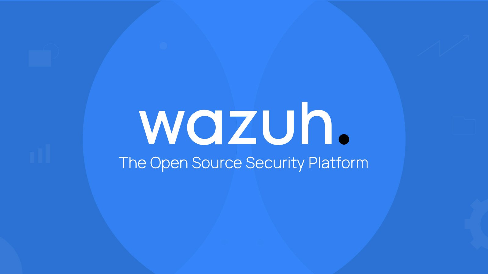
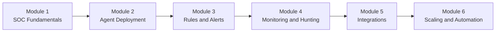
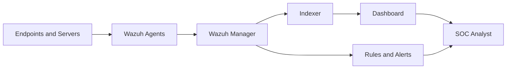

# SOC Analyst with Wazuh

This repository teaches SOC operations through a Wazuh-centered learning path. It starts with core SOC concepts, then moves into deployment, detection engineering, monitoring, integrations, and enterprise scaling.




## Project Status

This repository is actively being improved. Some modules are more complete than others, so use the tracking tables below to see what is ready now and what is still planned.

| Area | Status | Notes |
|---|---|---|
| Core learning path | In progress | All 6 modules have top-level structure and theory direction |
| Beginner onboarding | In progress | Module 1 is the strongest starting point |
| Hands-on labs | Partial | Labs currently exist in Module 1 and Module 5 |
| Supporting resources | Partial | Resources currently exist in Module 1 and Module 5 |
| Navigation and links | Improved | Main README and internal links were cleaned up |
| Architecture visuals | In progress | Mermaid diagrams were added to key documentation pages |

## What You Will Learn

By working through the modules in order, you will learn how to:
- Understand how a SOC operates day to day
- Deploy Wazuh managers and agents in a lab environment
- Read alerts, write rules, and improve detection quality
- Investigate threats with hunting and monitoring workflows
- Integrate Wazuh with tools such as Suricata, ELK, MISP, and TheHive
- Plan for larger, enterprise-style deployments

## Learning Flow



## How Wazuh Fits In A SOC



## Repository Structure

The repository is not identical in every module yet. Some modules currently include only theory, while others also include labs and resources.

```
SOC-Analyst-with-Wazuh-Beginner-to-Advanced/
├── README.md
├── Module-1-SOC-Fundamentals/
│   ├── README.md
│   ├── theory/
│   ├── labs/
│   └── resources/
├── Module-2-Agent-Deployment/
│   ├── README.md
│   └── theory/
├── Module-3-Rules-Alerts-Detection/
│   ├── README.md
│   └── theory/
├── Module-4-Security-Monitoring/
│   ├── README.md
│   └── theory/
├── Module-5-Integrations-Advanced/
│   ├── README.md
│   ├── theory/
│   ├── labs/
│   └── resources/
└── Module-6-Scaling-Automation/
   ├── README.md
   └── theory/
```

## Module Tracking

Use this table to track both repository completeness and your own study progress.

| Module | Focus | Current Content | Repo Status | Your Progress |
|---|---|---|---|---|
| Module 1 | SOC fundamentals and Wazuh basics | README, theory, labs, resources | Strong starting module | [ ] |
| Module 2 | Agent deployment | README, theory | Theory-focused | [ ] |
| Module 3 | Rules and alerts | README, theory | Early-stage module | [ ] |
| Module 4 | Monitoring and hunting | README, theory | Early-stage module | [ ] |
| Module 5 | Integrations | README, theory, labs, resources | Most complete advanced module | [ ] |
| Module 6 | Scaling and automation | README, theory | Roadmap-stage module | [ ] |

## Content Coverage Tracker

| Module | README | Theory | Labs | Resources |
|---|---|---|---|---|
| Module 1 | Yes | Yes | Yes | Yes |
| Module 2 | Yes | Yes | No | No |
| Module 3 | Yes | Yes | No | No |
| Module 4 | Yes | Yes | No | No |
| Module 5 | Yes | Yes | Yes | Yes |
| Module 6 | Yes | Yes | No | No |

## Modules

### [Module 1: SOC Fundamentals](./Module-1-SOC-Fundamentals/README.md)
Foundation concepts: SOC roles, SIEM basics, Wazuh architecture, OS choices, and first labs.

### [Module 2: Agent Deployment](./Module-2-Agent-Deployment/README.md)
Agent types and deployment guidance for Windows and Linux environments.

### [Module 3: Rules, Alerts, and Detection](./Module-3-Rules-Alerts-Detection/README.md)
Detection logic, decoders, rule writing, and alert interpretation.

### [Module 4: Security Monitoring and Threat Hunting](./Module-4-Security-Monitoring/README.md)
Threat hunting, MITRE ATT&CK mapping, file integrity monitoring, and vulnerability detection.

### [Module 5: Integrations and Advanced SOC Tools](./Module-5-Integrations-Advanced/README.md)
Integrations with Suricata, ELK, MISP, TheHive, and broader SOC data flows.

### [Module 6: Scaling and Automation](./Module-6-Scaling-Automation/README.md)
Enterprise architecture, clustering, automation, and operational scaling.

## Roadmap

### High Priority
- Expand beginner-first labs for Module 2
- Add more rule-writing content to Module 3
- Add monitoring labs and resources to Module 4
- Modernize installation guidance where version-specific steps are outdated

### Medium Priority
- Add screenshots and annotated diagrams for core workflows
- Add quiz or checkpoint sections to each module
- Add more SOC case-study examples based on real alert flows

### Long Term
- Add enterprise labs for Module 6
- Add contribution guidelines and content standards
- Add issue templates for documentation and lab improvements

## Recommended Study Method

1. Read the module README first.
2. Study theory before running labs.
3. Keep notes on commands, ports, configs, and troubleshooting steps.
4. Build a small lab and reuse it across modules.
5. Revisit earlier modules when later topics feel abstract.

## Lab Baseline

For the smoothest learning experience, use:
- 8 GB RAM minimum, 16 GB recommended
- 50 GB or more free storage
- One Linux VM for Wazuh server components
- One Windows endpoint and one Linux endpoint for agent testing
- VirtualBox, VMware, or a small cloud lab

## Best Starting Point

Start with [Module-1-SOC-Fundamentals/README.md](./Module-1-SOC-Fundamentals/README.md). If you are new to SIEM or SOC work, do not skip the architecture and lab sections.

## Suggested Way To Track Your Learning

1. Mark one module as complete only after you finish both reading and practice.
2. Keep a separate notes file for commands, ports, log paths, and troubleshooting steps.
3. Record one real example per module, such as a failed login, file change, or Suricata alert.
4. Revisit Module 1 architecture after finishing Module 3 and Module 5.
5. If a module is theory-only, treat it as concept preparation and pair it with your own lab notes.

## Contribution Tracking

If you want to contribute to this repository, the safest improvement areas are:
- Fixing broken links or inaccurate file references
- Improving readability for beginners
- Adding diagrams, screenshots, and walkthroughs
- Expanding missing labs in Modules 2, 3, 4, and 6
- Updating outdated installation steps with clear version notes

For open-source contributors:
- Read [CONTRIBUTING.md](./CONTRIBUTING.md) for the fork, branch, and pull request workflow
- Read [docs/DOCUMENTATION-GUIDE.md](./docs/DOCUMENTATION-GUIDE.md) for writing standards and documentation structure