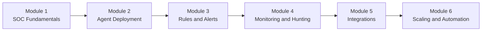
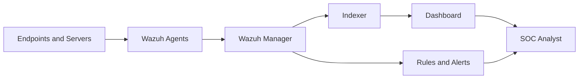

# SOC Analyst with Wazuh

This repository teaches SOC operations through a Wazuh-centered learning path. It starts with core SOC concepts, then moves into deployment, detection engineering, monitoring, integrations, and enterprise scaling.

## What You Will Learn

By working through the modules in order, you will learn how to:
- Understand how a SOC operates day to day
- Deploy Wazuh managers and agents in a lab environment
- Read alerts, write rules, and improve detection quality
- Investigate threats with hunting and monitoring workflows
- Integrate Wazuh with tools such as Suricata, ELK, MISP, and TheHive
- Plan for larger, enterprise-style deployments

## Learning Flow



## How Wazuh Fits In A SOC



## Repository Structure

The repository is not identical in every module yet. Some modules currently include only theory, while others also include labs and resources.

```
SOC-Analyst-with-Wazuh-Beginner-to-Advanced/
├── README.md
├── Module-1-SOC-Fundamentals/
│   ├── README.md
│   ├── theory/
│   ├── labs/
│   └── resources/
├── Module-2-Agent-Deployment/
│   ├── README.md
│   └── theory/
├── Module-3-Rules-Alerts-Detection/
│   ├── README.md
│   └── theory/
├── Module-4-Security-Monitoring/
│   ├── README.md
│   └── theory/
├── Module-5-Integrations-Advanced/
│   ├── README.md
│   ├── theory/
│   ├── labs/
│   └── resources/
└── Module-6-Scaling-Automation/
   ├── README.md
   └── theory/
```

## Modules

### [Module 1: SOC Fundamentals](./Module-1-SOC-Fundamentals/README.md)
Foundation concepts: SOC roles, SIEM basics, Wazuh architecture, OS choices, and first labs.

### [Module 2: Agent Deployment](./Module-2-Agent-Deployment/README.md)
Agent types and deployment guidance for Windows and Linux environments.

### [Module 3: Rules, Alerts, and Detection](./Module-3-Rules-Alerts-Detection/README.md)
Detection logic, decoders, rule writing, and alert interpretation.

### [Module 4: Security Monitoring and Threat Hunting](./Module-4-Security-Monitoring/README.md)
Threat hunting, MITRE ATT&CK mapping, file integrity monitoring, and vulnerability detection.

### [Module 5: Integrations and Advanced SOC Tools](./Module-5-Integrations-Advanced/README.md)
Integrations with Suricata, ELK, MISP, TheHive, and broader SOC data flows.

### [Module 6: Scaling and Automation](./Module-6-Scaling-Automation/README.md)
Enterprise architecture, clustering, automation, and operational scaling.

## Recommended Study Method

1. Read the module README first.
2. Study theory before running labs.
3. Keep notes on commands, ports, configs, and troubleshooting steps.
4. Build a small lab and reuse it across modules.
5. Revisit earlier modules when later topics feel abstract.

## Lab Baseline

For the smoothest learning experience, use:
- 8 GB RAM minimum, 16 GB recommended
- 50 GB or more free storage
- One Linux VM for Wazuh server components
- One Windows endpoint and one Linux endpoint for agent testing
- VirtualBox, VMware, or a small cloud lab

## Best Starting Point

Start with [Module-1-SOC-Fundamentals/README.md](./Module-1-SOC-Fundamentals/README.md). If you are new to SIEM or SOC work, do not skip the architecture and lab sections.